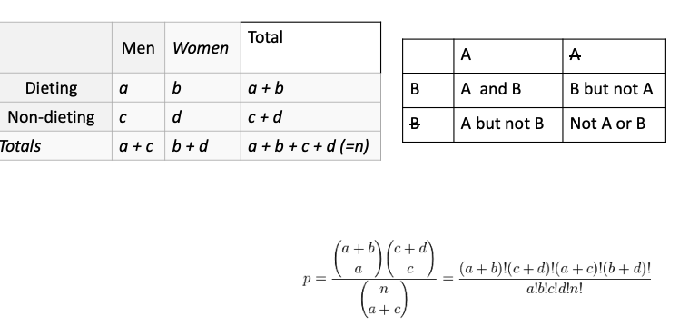

```{r libraries}
library(tidyverse)
library(UpSetR)
library(ComplexHeatmap)
library(zoo) 
library(ggthemes)
library(fs)
```


```{r setup}
set.seed(1014)
options(digits = 3)

knitr::opts_chunk$set(
  comment = "#>",
  collapse = TRUE,
  cache = TRUE,
  out.width = "70%",
  fig.align = 'center',
  fig.width = 6,
  fig.asp = 0.618,  # 1 / phi
  fig.show = "hold",
  dev = c("pdf", "png")
)

lappend <- function(lst, obj) {
  lst[[length(lst)+1]] <- obj
  return(lst)
}

fun_name = "plot_results"
save_data_dir = "output_files"
dir.create(save_data_dir, showWarnings = FALSE)
options(dplyr.print_min = 6, dplyr.print_max = 6)

figure_dir = "./output_plots"
dir.create(figure_dir, showWarnings = FALSE)


save_object <- function(object, save_data_dir) {
  object_name = deparse(substitute(object))
  file_name = paste(object_name, fun_name, "RData", sep = ".")
  file_path = paste(save_data_dir, file_name, sep="/")
  save(list = eval(object_name), file = file_path)
}

tidy_pca = function(x) {
  x.matrix <- x[,-1] %>% as.matrix()
  rownames(x.matrix) <- as.data.frame(x)[,1]
  return(x.matrix)
}
```

```{r}

motif_path = "../../data/2019-04-25/2019_2_18/"


motifs_raw <- tibble( filename = path(motif_path) %>%  dir_ls(regexp = ".*?\\/motifs.*?_frame.csv")) %>%
  mutate(file_contents = map(filename, read_csv))


motifs_raw <- motifs_raw %>% mutate(filename = basename(filename)) %>% unnest(file_contents)


#motif_raw = read_delim("../../data/2019-04-25/2019_2_18/motifs1_09_8_frame.csv", delim = ",")


```


Analysis motifs per gene
```{r}
motifs_raw %>% 
  mutate(filename = str_replace_all(filename, "_frame.csv", ""),
         filename = str_replace_all(filename, "motifs1_", "")) %>%
  mutate(genes = str_replace_all(string = genes, pattern = "[\\[\\]\\n]+", replacement = "")) %>%
  mutate(genes_list = str_split(string = genes, pattern = "[:space:]")) -> motifs_raw

motifs_gene <- motifs_raw %>% select(filename, cluster, region, genes_list) %>%
  unnest(genes_list) %>% filter(genes_list != "")


motifs_gene %>% separate(filename, c("identity", "cl_size")) -> motifs_gene
motifs_gene %>% group_by(identity, cl_size, genes_list) %>% summarise(n=n()) %>%
  ggplot(aes(x = n)) +
   geom_histogram() +
   facet_wrap(identity~cl_size) +
   labs(x = "n of PWMs per gene")
      
#per
motifs_gene %>% 
  group_by(identity, cl_size, region, genes_list) %>% summarise(n=n()) %>% arrange(genes_list)
  ggplot(aes(x = n, fill = region)) +
   geom_histogram() +
   facet_wrap(identity~cl_size) +
   labs(x = "n of PWMs per gene")

```

```{r fisher_fig, echo=FALSE, fig.cap="A caption", out.width = '100%'}

```

```{r}
TeaTasting <- 
  matrix(c(3, 1, 1, 3),
       nrow = 2,
       dimnames = list(Guess = c("Milk", "Tea"),
                       Truth = c("Milk", "Tea")))
fisher.test(TeaTasting, alternative = "greater")

# A r x c table  Agresti (2002, p. 57) Job Satisfaction
Job <- matrix(c(1,2,1,0, 3,3,6,1, 10,10,14,9, 6,7,12,11), 4, 4,
dimnames = list(income = c("< 15k", "15-25k", "25-40k", "> 40k"),
                satisfaction = c("VeryD", "LittleD", "ModerateS", "VeryS")))
fisher.test(Job)


motifs_gene %>% filter(identity == "09", cl_size == "4") %>%
  group_by(identity, cl_size, cluster) %>% summarise(n=n()) %>% arrange(-n)


dat <- read.table(text="TrxID Items Quant
Trx1 A 3
Trx1 B 1
Trx1 C 1
Trx2 E 3
Trx2 B 1
Trx3 B 1
Trx3 C 4
Trx4 D 1
Trx4 E 1
Trx4 A 1
Trx5 F 5
Trx5 B 3
Trx5 C 2
Trx5 D 1", header=T)

dat
#making the boolean matrix   
library(reshape2)
dat2 <- melt(dat)

w = table(dat[1:2])
V <- crossprod(w)

melt(V[upper.tri(V)])

fisher.test(matrix(c(V["C","B"], V["B","B"] - V["C","B"], V["C","C"] - V["C","B"],  crossprod(!w)["C", "B"]), ncol = 2))

t(w) %*% w


V
w <- dcast(dat2, Items~TrxID)
```